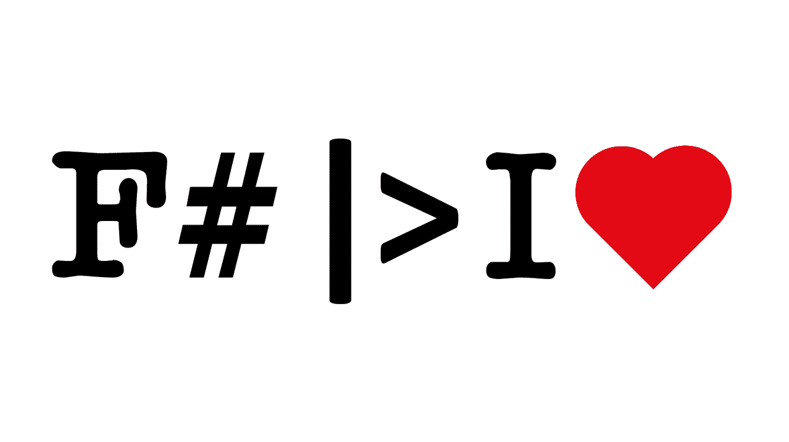

# Chapter7. FSharp microservices

## Goals
- Understand pure functional domain modelling using DDD concepts
- Build evented domains using the [`evented`](https://github.com/osstotalsoft/nbb/tree/master/src/Core/NBB.Core.Evented.FSharp#README.md) monad
- Clean (functional) architecture using impure-pure-impure sandwich
- Dependency inversion via the [`effect`](https://github.com/osstotalsoft/nbb/tree/master/src/Core/NBB.Core.Effects.FSharp#README.md) monad
- Build application pipelines using the [`NBB.Mediator.FSharp`](https://github.com/osstotalsoft/nbb/tree/master/src/Application/NBB.Application.Mediator.FSharp#README.md)
- Build web apis using [`Giraffe`](https://github.com/giraffe-fsharp/Giraffe)
- Build event driven stream processors (workers) powered by [`NBB.Messaging.Host`](https://github.com/osstotalsoft/nbb/tree/master/src/Messaging/NBB.Messaging.Host#README.md) and [`NBB.Messaging.Effects`](https://github.com/osstotalsoft/nbb/tree/master/src/Messaging/NBB.Messaging.Effects#README.md)
  
## Curricula
- [`F# Types - Microsoft docs`](https://docs.microsoft.com/en-us/dotnet/fsharp/language-reference/fsharp-types)
- [`The "Understanding F# types" series by Scott Wlaschin`](https://fsharpforfunandprofit.com/series/understanding-fsharp-types/)
- [`Domain Modeling Made Functional by Scott Wlaschin`](https://github.com/swlaschin/DomainModelingMadeFunctional)
- [`Easy domain modelling with types by Mark Seemann`](https://blog.ploeh.dk/2016/11/28/easy-domain-modelling-with-types/)
- [`Six approaches to dependency injection by Scott Wlaschin`](https://fsharpforfunandprofit.com/posts/dependencies/)
- [`Dealing with complex dependency injection in F# by Bartosz Sypytkowski`](https://bartoszsypytkowski.com/dealing-with-complex-dependency-injection-in-f/)
- [`Purity in an impure language with the free monad – by example of a Tic-Tac-Toe backend with CQRS and event sourcing`](http://blog.leifbattermann.de/2016/12/25/purity-in-an-impure-language-free-monad-tic-tac-toe-cqrs-event-souring/#more-1096)
- [`F# free monad recipe by Mark Seemann`](https://blog.ploeh.dk/2017/08/07/f-free-monad-recipe/)
- [`Giraffe`](https://github.com/giraffe-fsharp/Giraffe)

## Examples
- See folder [`Sample`](./Sample) for a full working web api and messaging worker

  

