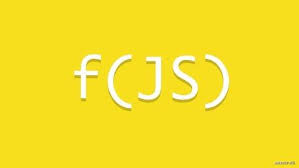

# Chapter8. Javascript libraries

## Goals
- Recognize the functional aspects of the language 
- Get to know some functional javascript libraries like [`Ramda`](https://ramdajs.com/)
- Implement algebraic structures with respect to the [`Fantasy Land Specification`](https://github.com/fantasyland/fantasy-land)
- Look under the hood of the functional javascript libraries from [`osstotalsoft\jsbb`](https://github.com/osstotalsoft/jsbb)
  
## Curricula
- [The Rise and Fall and Rise of Functional Programming](https://medium.com/javascript-scene/the-rise-and-fall-and-rise-of-functional-programming-composable-software-c2d91b424c8c)
- [Professor frisby's mostly adequate guide](https://mostly-adequate.gitbooks.io/mostly-adequate-guide)
- [Fantasy Land](https://github.com/fantasyland/fantasy-land/blob/master/README.md)
- [Fantas, Eel, and Specification](http://www.tomharding.me/fantasy-land/)
- [Eric Elliott - Composing Software: The Book](https://medium.com/javascript-scene/composing-software-the-book-f31c77fc3ddc)
- [James Sinclair Blog](https://jrsinclair.com)

## Examples
- See folder [`Sample`](./Sample)

  

