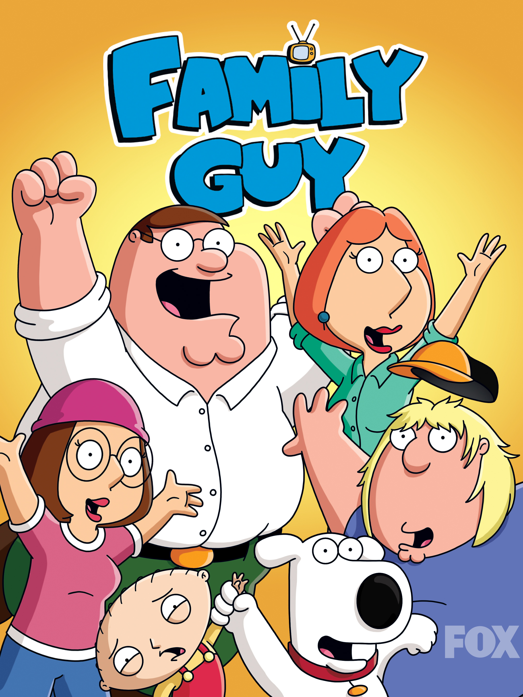

# functional-guy
##### Functional Programming Guild for Great Good!

*Can programming be liberated from the von Neumann style?*

## General
The goal of this guild members is to learn the fp paradigm and not a speciffic programming language.
Members of this guild will use the principles of fp paradigm in various programming languages like:
  - Haskell
  - Lisp
  - F#
  - C#
  - Scala
  - Clojure
  - JavaScript
  - Elm
  - Go
  - Rust

Because we all need a common language to communicate and share ideas we will learn and embrace the following languages:
  - Lambda Calculus
  - Haskell
  - Category Theory

During our meetings and presentations we will try to connect our ideas with implementations (where possible) with other programming languages.

## Chapters
  - [`Chapter1. Inception`](./Chapter1.%20Inception#readme)
  - [`Chapter2. The foundation`](./Chapter2.%20The%20foundation#readme)
  - [`Chapter3. Haskell's Type System`](./Chapter3.%20Haskell's%20Type%20System#readme)
  - [`Chapter4. IO in Haskell`](./Chapter4.%20IO%20in%20Haskell#readme)
  - [`Chapter5. Functors Applicatives & Monads`](./Chapter5.%20Functors%20Applicatives%20%26%20Monads#readme)
  - [`Chapter6. Computational effects`](./Chapter6.%20Computational%20effects#readme)

## Computability theory
  - [David Hilbert](https://en.wikipedia.org/wiki/David_Hilbert)
  - [Entscheidungsproblem](https://en.wikipedia.org/wiki/Entscheidungsproblem)
  - [Kurt Gödel](https://en.wikipedia.org/wiki/Kurt_G%C3%B6del)
  - [Gödel's incompleteness theorems](https://en.wikipedia.org/wiki/G%C3%B6del%27s_incompleteness_theorems#:~:text=G%C3%B6del's%20incompleteness%20theorems%20are%20two,in%20the%20philosophy%20of%20mathematics.)
  - [Gödel's General recursive function](https://en.wikipedia.org/wiki/General_recursive_function)
  - [Alonzo Church](https://en.wikipedia.org/wiki/Alonzo_Church)
  - [Lambda calculus](https://en.wikipedia.org/wiki/Lambda_calculus)
  - [Alan Turing](https://en.wikipedia.org/wiki/Alan_Turing)
  - [The Turing Machine](https://en.wikipedia.org/wiki/Turing_machine)
  - [Church–Turing thesis](https://en.wikipedia.org/wiki/Church%E2%80%93Turing_thesis#:~:text=It%20states%20that%20a%20function,the%20British%20mathematician%20Alan%20Turing.)

## Lambda Calcullus
- [Lambda calculus](https://en.wikipedia.org/wiki/Lambda_calculus)
- [Fixed-point combinators in JavaScript: Memoizing recursive functions](http://matt.might.net/articles/implementation-of-recursive-fixed-point-y-combinator-in-javascript-for-memoization/)
- [SKI combinator calculus](https://en.wikipedia.org/wiki/SKI_combinator_calculus#Self-application_and_recursion)

## FP articles
  - [The Rise and Fall and Rise of Functional Programming](https://medium.com/javascript-scene/the-rise-and-fall-and-rise-of-functional-programming-composable-software-c2d91b424c8c)
  - [THINGS I WISH SOMEONE HAD EXPLAINED ABOUT FUNCTIONAL PROGRAMMING](https://jrsinclair.com/articles/2019/what-i-wish-someone-had-explained-about-functional-programming/)
  - [Applicative vs Normal evaluation form](https://courses.cs.washington.edu/courses/cse505/99au/functional/applicative-normal.pdf)
  - [Normal, Applicative and Lazy Evaluation](https://sookocheff.com/post/fp/evaluating-lambda-expressions/)
  - [Bartosz Milewski - Category Theory 5.2: Algebraic Data Types](https://www.youtube.com/watch?v=w1WMykh7AxA&t=1214s)
  - [Bartosz Milewski - Simple Algebraic Data Types](https://bartoszmilewski.com/2015/01/13/simple-algebraic-data-types/)
  - [Monads and Effects by Bartosz Milewski](https://bartoszmilewski.com/2016/11/30/monads-and-effects/)
  - [Eugenio Moggi, Notions of Computation and Monads. This is a hard core research paper that started the whole monad movement in functional languages.](https://person.dibris.unige.it/moggi-eugenio/ftp/ic91.pdf)

## FP Video
  - ["Propositions as Types" by Philip Wadler](https://www.youtube.com/watch?v=IOiZatlZtGU)
  - [Why Functional Programming Matters by John Hughes at Functional Conf 2016](https://www.youtube.com/watch?v=XrNdvWqxBvA)
  - [Simon Peyton-Jones: Escape from the ivory tower: the Haskell journey](https://www.youtube.com/watch?v=re96UgMk6GQ)
  - [Lambda World 2019 - A Series of Unfortunate Effects - Robert M. Avram](https://www.youtube.com/watch?v=y5jZnMImbMY)
  - [Lambda World 2019 - A categorical view of computational effects - Emily Riehl](https://www.youtube.com/watch?v=Ssx2_JKpB3U)
  - ["Everything Old is New Again: Quoted Domain Specific Languages" by Philip Wadler](https://www.youtube.com/watch?v=DlBwJ4rvz5c)
  - [Hitler reacts to Functional Programming](https://www.youtube.com/watch?v=ADqLBc1vFwI)

## Haskell books
  - Christopher Allen, Julie Moronuki - Haskell programming from first principles - 2016
  - Get Programming with Haskell by Will Kurt
  - [Learn You a Haskell for Great Good!](http://learnyouahaskell.com/chapters)
  - [Real World Haskell by Bryan O'Sullivan, Don Stewart, and John Goerzen](http://book.realworldhaskell.org/read/)
  

## Haskell articles
  - [Vasile Cuzmin - Getting started with Haskell](https://github.com/VCuzmin/Haskell)
  - [Lexi Lambda - An opinionated guide to Haskell in 2018](https://lexi-lambda.github.io/blog/2018/02/10/an-opinionated-guide-to-haskell-in-2018/)
  - [Stack vs. Platform vs. Cabal](https://stackoverflow.com/questions/48733970/how-to-install-haskell-platform-or-stack-in-2018-on-linux)
  - [Haskell vs. Ada vs. C++ vs. Awk vs. ...An Experiment in Software Prototyping Productivity](http://citeseerx.ist.psu.edu/viewdoc/download?doi=10.1.1.368.1058&rep=rep1&type=pdf)

## Haskell tools
  - [The Haskell Tool Stack](https://docs.haskellstack.org/en/stable/README/)
  - [The Haskell Cabal](https://www.haskell.org/cabal/)
  - [Haskell Platform](https://www.haskell.org/platform/)
  - [Hoogle](https://hoogle.haskell.org/) - Haskell search engine; you can search a function by its type/definition. Just fill the definition in the search box!
  - [haskell repl](https://repl.it/languages/haskell)

## Functional JavaScript
- [Professor frisby's mostly adequate guide](https://mostly-adequate.gitbooks.io/mostly-adequate-guide)
- [Fantasy Land](https://github.com/fantasyland/fantasy-land/blob/master/README.md)
- [Fantas, Eel, and Specification](http://www.tomharding.me/fantasy-land/)
- [Eric Elliott - Composing Software: The Book](https://medium.com/javascript-scene/composing-software-the-book-f31c77fc3ddc)
- [James Sinclair Blog](https://jrsinclair.com)

## F#
- [Ploeh - the IO container](https://blog.ploeh.dk/2020/06/08/the-io-container/)
- [Writing custom F# LINQ query builder](http://tomasp.net/blog/2015/query-translation/)

## Other
  - [Structure and interpretation of computer programs MIT](https://sarabander.github.io/sicp/html/index.xhtml#SEC_Contents) 
  - [Implementing GADT's in OOP](https://www.microsoft.com/en-us/research/wp-content/uploads/2016/02/gadtoop.pdf)
  
  

